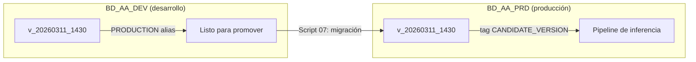

# Naming Convention — Models & Feature Store

> Propuesta de nomenclatura escalable para el registro de modelos y feature stores
> en Snowflake, diseñada para soportar múltiples modelos, granularidades y ambientes.

---

## 1. Model Naming

### 1.1 Pattern

```
<target>_<entity>_<frequency>_<method>
```

Cada dimensión usa un código de **4 a 7 letras** que identifica de forma única el aspecto
del modelo que representa. Este vocabulario se mantiene en una tabla de referencia
(sección 4) y debe consultarse antes de registrar cualquier modelo nuevo.

| Dimensión | ¿Qué describe? | Códigos/Ejemplos |
|-----------|-----------------|------------------|
| **target** | Variable que se predice | `UNIBOX`, `PROB` (probability), `OOS` (out-of-stock) |
| **entity** | Nivel/granularidad de la entidad | `CUSTBPR` (customer×BPR), `CUSTPROD` (customer×product), `STORE` |
| **frequency** | Granularidad temporal | `WEEKLY`, `MONTHLY`, `DAILY` |
| **method** | Tipo de modelo / metodología | `FORECAST`, `REGRESS` (regresión), `CLASSIF` (clasificación) |


### 1.2 Ejemplos

| Databricks (actual) | Snowflake (propuesto) | Descripción |
|---|---|---|
| `forecast_bpr_customer_week` | `UNIBOX_CUSTBPR_WEEKLY_FORECAST` | Forecast de uni-box, customer × BPR, semanal |
| *(futuro)* probability model | `PROB_CUSTPROD_MONTHLY_CLASSIF` | Probabilidad, customer × product, mensual, clasificación |
| *(futuro)* regression model | `UNIBOX_CUSTBPR_DAILY_REGRESS` | Regresión de uni-box, diario |

> [!TIP]
> **Brevidad vs. Claridad**: Aunque el equipo de Snowflake sugería 3 letras, hemos expandido los códigos a términos de **4-7 letras** para maximizar la legibilidad humana. Esto evita ambigüedades sin generar nombres excesivamente largos que dificulten la codificación.


### 1.3 Versioning & Lifecycle

Cada modelo tiene múltiples **versiones** que representan iteraciones de entrenamiento.
El ciclo de vida del modelo se gestiona de forma distinta según el ambiente:

```
v_YYYYMMDD_HHMM      ← formato de versión (e.g. v_20260311_1430)
```

#### Ambiente de Desarrollo (`BD_AA_DEV`)

En desarrollo se usan **aliases** para marcar el estado del modelo dentro del ciclo
de experimentación. El alias `PRODUCTION` indica que esa versión está lista para
ser promovida al ambiente productivo.

| Mecanismo | Propósito | Ejemplo |
|-----------|-----------|---------|
| Alias `PRODUCTION` | Versión lista para promoción a PROD | `ALTER MODEL ... SET ALIAS=PRODUCTION` |
| Alias `CHALLENGER` | Versión candidata en evaluación (A/B, shadow) | `ALTER MODEL ... SET ALIAS=CHALLENGER` |

> [!NOTE]
> Los aliases en DEV **no ejecutan inferencia directamente**. Solo sirven para
> identificar qué versión será migrada al ambiente de producción por el script 07.

#### Ambiente de Producción (`BD_AA_PRD`)

En producción **no se usan aliases**. Todo se gestiona mediante **tags**, que son
leídos por los pipelines de inferencia y observabilidad para determinar qué versión ejecutar.

| Mecanismo | Propósito | Ejemplo |
|-----------|-----------|---------|
| Tag `CANDIDATE_VERSION` | Versión activa para inferencia batch | `ALTER MODEL ... SET TAG CANDIDATE_VERSION = 'v_20260311_1430'` |
| Tag `ROLLBACK_VERSION` | Versión anterior (rollback rápido) | `ALTER MODEL ... SET TAG ROLLBACK_VERSION = 'v_20260301_0900'` |




### 1.4 Schema Layout

En desarrollo se usa una sola base de datos (`BD_AA_DEV`). En producción se usan
**dos bases de datos independientes** (`BD_AA_DEV` para training y `BD_AA_PRD` para inferencia).

```
BD_AA_DEV (desarrollo)
├── SC_MODELS_BMX                    ← registry de desarrollo
│   ├── UNIBOX_CUSTBPR_WEEKLY_FORECAST  ← modelo particionado (público)
│   ├── unibox_custbpr_weekly_forecast__grp_0_1  ← sub-modelos internos
│   └── ...
├── SC_STORAGE_BMX_PS                ← datos de entrenamiento
└── SC_FEATURES_BMX                  ← feature store

BD_AA_PRD (producción)
├── SC_MODELS_BMX_PRD                ← registry de producción
│   └── UNIBOX_CUSTBPR_WEEKLY_FORECAST  ← modelo migrado
├── SC_STORAGE_BMX_PS_PRD            ← datos de inferencia + predicciones
└── SC_FEATURES_BMX_PRD              ← feature store producción
```

> [!IMPORTANT]
> Los sub-modelos (los 16 modelos por grupo) son **artefactos internos** del
> entrenamiento. Solo el **modelo particionado** (`UNIBOX_CUSTBPR_WEEKLY_FORECAST`)
> se migra a producción y es el artefacto público.
> Sub-modelos usan la convención: `{model}__{grupo}` (doble underscore).

---

## 2. Feature Store Naming

### 2.1 Strategy: 1 Feature Store per Model (1:1)

Dado que cada modelo tiene su propio pipeline de feature engineering con
transformaciones específicas, la relación **1:1** es el punto de partida recomendado.
Esto simplifica la trazabilidad y evita dependencias entre modelos.

### 2.2 Pattern

```
FEAT_<model_name>
```

| Databricks (actual) | Snowflake (propuesto) |
|---|---|
| `UNI_BOX_FEATURES` | `FEAT_UNIBOX_CUSTBPR_WEEKLY_FORECAST` |


### 2.3 Schema & Table Layout

La feature table base contiene las features materializadas. Las vistas proporcionan
diferentes cortes del mismo dataset según el caso de uso (train, inferencia, holdout).

```
SC_FEATURES_BMX
├── FEAT_UNIBOX_CUSTBPR_WEEKLY_FORECAST              ← tabla materializada de features
├── FEAT_UNIBOX_CUSTBPR_WEEKLY_FORECAST__TRAIN_VW    ← vista: features + target (entrenamiento)
├── FEAT_UNIBOX_CUSTBPR_WEEKLY_FORECAST__INF_VW      ← vista: features sin target (inferencia)
└── FEAT_UNIBOX_CUSTBPR_WEEKLY_FORECAST__HOLDOUT_VW  ← vista: holdout temporal (baselines)
```

> [!IMPORTANT]
> **Contrato de interfaz**: El pipeline de entrenamiento debe leer **siempre** de
> `FEAT_<model>__TRAIN_VW`. Cuando el Feature Store se conecte a fuentes de
> producción, solo cambia la **materialización upstream** (cómo se llena la tabla).
> La vista mantiene la misma estructura, garantizando **cero cambios** en los
> scripts de entrenamiento e inferencia.


### 2.4 Shared Features (Futuro)

Si múltiples modelos comparten features comunes (e.g. features de cliente),
se extraen a una tabla compartida por entidad:

```
FEAT_SHARED_<entity>_<frequency>       e.g. FEAT_SHARED_CBR_WK
```

Los feature stores específicos de cada modelo pueden referenciar la tabla
compartida mediante JOINs o vistas, manteniendo la interfaz `FEAT_<model>__*_VW`.

---

## 3. Observability Tables

### 3.1 Pattern

```
OBS_<model>__<metric_type>
```

El doble underscore (`__`) separa el nombre del modelo del tipo de métrica,
manteniendo consistencia con la convención de vistas del feature store.

| Nombre actual | Nombre propuesto | Tipo |
|---|---|---|
| `DA_PREDICTIONS` | `OBS_UNIBOX_CUSTBPR_WEEKLY_FORECAST__PRED` | Predicciones |
| `DA_DATA_DRIFT` | `OBS_UNIBOX_CUSTBPR_WEEKLY_FORECAST__DATA_DRIFT` | Métricas de drift de datos |
| `DA_DATA_DRIFT_HISTOGRAMS` | `OBS_UNIBOX_CUSTBPR_WEEKLY_FORECAST__DATA_HIST` | Histogramas de datos (producción) |
| `DA_DATA_DRIFT_HISTOGRAMS_BASELINE` | `OBS_UNIBOX_CUSTBPR_WEEKLY_FORECAST__DATA_HIST_BL` | Histogramas de datos (baseline) |
| `DA_PREDICTION_DRIFT` | `OBS_UNIBOX_CUSTBPR_WEEKLY_FORECAST__PRED_DRIFT` | Métricas de drift de predicciones |
| `DA_PREDICTION_DRIFT_HISTOGRAMS` | `OBS_UNIBOX_CUSTBPR_WEEKLY_FORECAST__PRED_HIST` | Histogramas de predicciones (producción) |
| `DA_PREDICTION_DRIFT_HISTOGRAMS_BASELINE` | `OBS_UNIBOX_CUSTBPR_WEEKLY_FORECAST__PRED_HIST_BL` | Histogramas de predicciones (baseline) |
| `DA_PERFORMANCE` | `OBS_UNIBOX_CUSTBPR_WEEKLY_FORECAST__PERF` | Métricas de rendimiento (producción) |
| `DA_PERFORMANCE_BASELINE` | `OBS_UNIBOX_CUSTBPR_WEEKLY_FORECAST__PERF_BL` | Métricas de rendimiento (baseline) |

---

## 4. Vocabulary Registry

Tabla de referencia centralizada. **Agregar nuevos códigos aquí antes de
registrar un modelo nuevo** para garantizar unicidad y consistencia.

### 4.1 Targets (variable predictora)

| Código | Nombre completo | Descripción |
|--------|-----------------|-------------|
| `UNIBOX` | Uni-box | Unidades por caja por semana |
| `PROB` | Probability | Probabilidad de evento |
| `OOS` | Out-of-stock | Indicador de desabasto |

### 4.2 Entities (nivel de granularidad)

| Código | Nombre completo | Descripción |
|--------|-----------------|-------------|
| `CUSTBPR` | Customer × BPR | Cliente cruzado con brand/presencia/ruta |
| `CUSTPROD` | Customer × Product | Cliente cruzado con producto |
| `STORE` | Store | Nivel tienda |
| `SKU` | SKU | Nivel SKU individual |

### 4.3 Frequencies (granularidad temporal)

| Código | Nombre completo |
|--------|-----------------|
| `DAILY` | Daily (diario) |
| `WEEKLY` | Weekly (semanal) |
| `MONTHLY` | Monthly (mensual) |

### 4.4 Methods (tipo de modelo)

| Código | Nombre completo | Descripción |
|--------|-----------------|-------------|
| `FORECAST` | Forecast | Pronóstico de series de tiempo |
| `REGRESS` | Regression | Regresión estadística / ML |
| `CLASSIF` | Classification | Clasificación binaria o multiclase |
| `RANKING` | Ranking | Modelos de recomendación |

> [!NOTE]
> Si un nuevo modelo no encaja en las dimensiones existentes, primero se
> propone la extensión del vocabulario para aprobación del equipo, y luego
> se registra. Esto previene proliferación de nombres inconsistentes.
