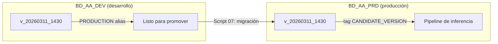

# Naming Convention — Models & Feature Store

> Propuesta de nomenclatura escalable para el registro de modelos y feature stores
> en Snowflake, diseñada para soportar múltiples modelos, granularidades y ambientes.

---

## 1. Model Naming

### 1.1 Pattern

```
<target>_<entity>_<frequency>_<method>
```

Cada dimensión usa un código de **4 a 7 letras** que identifica de forma única el aspecto
del modelo que representa. Este vocabulario se mantiene en una tabla de referencia
(sección 4) y debe consultarse antes de registrar cualquier modelo nuevo.

| Dimensión | ¿Qué describe? | Códigos/Ejemplos |
|-----------|-----------------|------------------|
| **target** | Variable que se predice | `UNIBOX`, `PROB` (probability), `OOS` (out-of-stock) |
| **entity** | Nivel/granularidad de la entidad | `CUSTBPR` (customer×BPR), `CUSTPROD` (customer×product), `STORE` |
| **frequency** | Granularidad temporal | `WEEKLY`, `MONTHLY`, `DAILY` |
| **method** | Tipo de modelo / metodología | `FORECAST`, `REGRESS` (regresión), `CLASSIF` (clasificación) |


### 1.2 Ejemplos

| Databricks (actual) | Snowflake (propuesto) | Descripción |
|---|---|---|
| `forecast_bpr_customer_week` | `UNIBOX_CUSTBPR_WEEKLY_FORECAST` | Forecast de uni-box, customer × BPR, semanal |
| *(futuro)* probability model | `PROB_CUSTPROD_MONTHLY_CLASSIF` | Probabilidad, customer × product, mensual, clasificación |
| *(futuro)* regression model | `UNIBOX_CUSTBPR_DAILY_REGRESS` | Regresión de uni-box, diario |

> [!TIP]
> **Brevidad vs. Claridad**: Aunque el equipo de Snowflake sugería 3 letras, hemos expandido los códigos a términos de **4-7 letras** para maximizar la legibilidad humana. Esto evita ambigüedades sin generar nombres excesivamente largos que dificulten la codificación.


### 1.3 Versioning & Lifecycle

Cada modelo tiene múltiples **versiones** que representan iteraciones de entrenamiento.
El ciclo de vida del modelo se gestiona de forma distinta según el ambiente:

```
v_YYYYMMDD_HHMM      ← formato de versión (e.g. v_20260311_1430)
```

#### Ambiente de Desarrollo (`BD_AA_DEV`)

En desarrollo se usan **aliases** para marcar el estado del modelo dentro del ciclo
de experimentación. El alias `PRODUCTION` indica que esa versión está lista para
ser promovida al ambiente productivo.

| Mecanismo | Propósito | Ejemplo |
|-----------|-----------|---------|
| Alias `PRODUCTION` | Versión lista para promoción a PROD | `ALTER MODEL ... SET ALIAS=PRODUCTION` |
| Alias `CHALLENGER` | Versión candidata en evaluación (A/B, shadow) | `ALTER MODEL ... SET ALIAS=CHALLENGER` |

> [!NOTE]
> Los aliases en DEV **no ejecutan inferencia directamente**. Solo sirven para
> identificar qué versión será migrada al ambiente de producción por el script 07.

#### Ambiente de Producción (`BD_AA_PRD`)

En producción **no se usan aliases**. Todo se gestiona mediante **tags**, que son
leídos por los pipelines de inferencia y observabilidad para determinar qué versión ejecutar.

| Mecanismo | Propósito | Ejemplo |
|-----------|-----------|---------|
| Tag `CANDIDATE_VERSION` | Versión activa para inferencia batch | `ALTER MODEL ... SET TAG CANDIDATE_VERSION = 'v_20260311_1430'` |
| Tag `ROLLBACK_VERSION` | Versión anterior (rollback rápido) | `ALTER MODEL ... SET TAG ROLLBACK_VERSION = 'v_20260301_0900'` |


```mermaid
flowchart LR
    subgraph DEV ["BD_AA_DEV (desarrollo)"]
        A["v_20260311_1430"] -- "PRODUCTION alias" --> B["Listo para promover"]
    end
    subgraph PROD ["BD_AA_PRD (producción)"]
        C["v_20260311_1430"] -- "tag CANDIDATE_VERSION" --> D["Pipeline de inferencia"]
    end
    B -- "Script 07: migración" --> C
```


### 1.4 Schema Layout

En desarrollo se usa una sola base de datos (`BD_AA_DEV`). En producción se usan
**dos bases de datos independientes** (`BD_AA_DEV` para training y `BD_AA_PRD` para inferencia).

```
BD_AA_DEV (desarrollo)
├── SC_MODELS_BMX                    ← registry de desarrollo
│   ├── UNIBOX_CUSTBPR_WEEKLY_FORECAST  ← modelo particionado (público)
│   ├── unibox_custbpr_weekly_forecast__grp_0_1  ← sub-modelos internos
│   └── ...
├── SC_STORAGE_BMX_PS                ← datos de entrenamiento
└── SC_FEATURES_BMX                  ← feature store

BD_AA_PRD (producción)
├── SC_MODELS_BMX_PRD                ← registry de producción
│   └── UNIBOX_CUSTBPR_WEEKLY_FORECAST  ← modelo migrado
├── SC_STORAGE_BMX_PS_PRD            ← datos de inferencia + predicciones
└── SC_FEATURES_BMX_PRD              ← feature store producción
```

> [!IMPORTANT]
> Los sub-modelos (los 16 modelos por grupo) son **artefactos internos** del
> entrenamiento. Solo el **modelo particionado** (`UNIBOX_CUSTBPR_WEEKLY_FORECAST`)
> se migra a producción y es el artefacto público.
> Sub-modelos usan la convención: `{model}__{grupo}` (doble underscore).

---

## 2. Feature Store Naming

### 2.1 Strategy: Shared Feature Store (Entity-Based)

El feature store se organiza por **entidad y frecuencia**, no por modelo. Esto permite
que múltiples modelos compartan las mismas features, reduciendo duplicación y
facilitando el mantenimiento.

### 2.2 Pattern

```
FEAT_<entity>_<frequency>
```

| Componente | ¿Qué describe? | Ejemplos |
|-----------|-----------------|----------|
| **entity** | Nivel/granularidad de la entidad | `CUSTBPR` (customer×BPR), `CUSTPROD`, `STORE` |
| **frequency** | Granularidad temporal | `WEEKLY`, `MONTHLY`, `DAILY` |

| Nombre antiguo (1:1 con modelo) | Nombre nuevo (compartido) |
|---|---|
| `FEAT_UNIBOX_CUSTBPR_WEEKLY_FORECAST` | `FEAT_CUSTBPR_WEEKLY` |
| `FEAT_PROB_CUSTPROD_MONTHLY_CLASSIF` | `FEAT_CUSTPROD_MONTHLY` |


### 2.3 Schema & Table Layout

La feature table base contiene las features materializadas. Las vistas proporcionan
diferentes cortes del mismo dataset según el caso de uso (train, inferencia, holdout).

```
SC_FEATURES_BMX
├── FEAT_CUSTBPR_WEEKLY                    ← tabla materializada de features
├── FEAT_CUSTBPR_WEEKLY__TRAIN             ← tabla: features + target (entrenamiento)
├── FEAT_CUSTBPR_WEEKLY__HOLDOUT           ← tabla: holdout temporal (baselines)
├── FEAT_CUSTBPR_WEEKLY__INF               ← tabla: features para inferencia
├── FEAT_CUSTBPR_WEEKLY__TRAIN_VW          ← vista: sobre __TRAIN (opcional)
├── FEAT_CUSTBPR_WEEKLY__HOLDOUT_VW        ← vista: sobre __HOLDOUT (para baselines)
└── FEAT_CUSTBPR_WEEKLY__INF_VW            ← vista: sobre __INF (para inferencia)
```

> [!IMPORTANT]
> **Contrato de interfaz**: El pipeline de entrenamiento puede leer de
> `FEAT_<entity>_<frequency>__TRAIN` (tabla) o `FEAT_<entity>_<frequency>__TRAIN_VW` (vista).
> Las vistas `_VW` se usan cuando se necesita aplicar transformaciones adicionales
> o filtros sin modificar las tablas base. Cuando el Feature Store se conecte a fuentes de
> producción, solo cambia la **materialización upstream** (cómo se llena la tabla).
> La interfaz mantiene la misma estructura, garantizando **cero cambios** en los
> scripts de entrenamiento e inferencia.


### 2.4 Shared Features Benefits

Al desacoplar el feature store del modelo específico:
- ✅ Múltiples modelos pueden usar las mismas features
- ✅ Reduce duplicación de datos
- ✅ Facilita experimentación con nuevos modelos
- ✅ Mejora mantenibilidad (una fuente de verdad)
- ✅ Permite evolución independiente de features y modelos

---

## 3. ML Experiment Names

### 3.1 Pattern

Los experimentos de ML (usados en hyperparameter search y model tracking) siguen
una nomenclatura que identifica el modelo, el tipo de búsqueda y la fecha:

```
EXP_<model>_<search_type>_<YYYYMMDD>
```

| Dimensión | ¿Qué describe? | Códigos/Ejemplos |
|-----------|-----------------|------------------|
| **model** | Nombre del modelo (mismo que en Model Registry) | `UNIBOX_CUSTBPR_WEEKLY_FORECAST` |
| **search_type** | Tipo de búsqueda de hiperparámetros | `RANDOM`, `BAYESIAN`, `GRID` |
| **YYYYMMDD** | Fecha de inicio del experimento | `20260317` |

### 3.2 Ejemplos

| Nombre actual | Nombre propuesto | Descripción |
|---|---|---|
| `hyperparameter_search_regression_20260317` | `EXP_UNIBOX_CUSTBPR_WEEKLY_FORECAST_RANDOM_20260317` | Búsqueda aleatoria de hiperparámetros |
| `hyperparameter_search_bayesian_20260317` | `EXP_UNIBOX_CUSTBPR_WEEKLY_FORECAST_BAYESIAN_20260317` | Búsqueda bayesiana de hiperparámetros |

> [!TIP]
> El sufijo de fecha permite múltiples ejecuciones del mismo experimento en
> diferentes días sin conflictos de nombres. Los experimentos son inmutables
> una vez creados, por lo que cada nueva iteración requiere un nuevo nombre.

---

## 4. Observability Tables

### 4.1 Strategy: Generic Observability (Model-Agnostic)

Las tablas de observabilidad son **genéricas** y no están atadas a un modelo específico.
Esto permite monitorear múltiples modelos en las mismas tablas, facilitando comparaciones
y análisis centralizados.

### 4.2 Pattern

```
OBS_<metric_type>
```

El doble underscore (`__`) se usa solo para separar sufijos de tipo de dato (como baseline).

#### Predicciones
OBS_PREDICTIONS              # Tabla de predicciones (producción)
OBS_PREDICTIONS_VW           # Vista de predicciones con metadata
OBS_PREDICTIONS_BL           # Tabla de predicciones (baseline)
OBS_PREDICTIONS_BL_VW        # Vista de predicciones baseline

####  Data Drift
OBS_DATA_HIST                # Histogramas de datos (producción)
OBS_DATA_HIST_BL             # Histogramas de datos (baseline)
OBS_DATA_DRIFT               # Métricas de data drift

####  Prediction Drift
OBS_PRED_HIST                # Histogramas de predicciones (producción)
OBS_PRED_HIST_BL             # Histogramas de predicciones (baseline)
OBS_PRED_DRIFT               # Métricas de prediction drift

####  Performance
OBS_PERFORMANCE              # Métricas de performance (producción)
OBS_PERFORMANCE_BL           # Métricas de performance (baseline)


### 4.3 Model Identification

Dado que las tablas son compartidas, cada registro incluye columnas para identificar
el modelo:

```sql
-- Columnas estándar en todas las tablas de observabilidad
MODEL_NAME       VARCHAR(64)   -- Nombre del modelo (e.g., 'UNIBOX_CUSTBPR_WEEKLY_FORECAST')
MODEL_VERSION    VARCHAR(32)   -- Versión del modelo (e.g., 'v_20260317_1430')
```

Esto permite:
- 🔍 Filtrar por modelo específico
- 📊 Comparar múltiples modelos en la misma tabla
- 📈 Análisis histórico de evolución de modelos
- 🎯 Alertas configurables por modelo

### 4.4 Benefits

Al usar tablas genéricas de observabilidad:
- ✅ Facilita comparación entre modelos
- ✅ Reduce proliferación de tablas (1 tabla para N modelos)
- ✅ Simplifica queries y dashboards (una sola fuente)
- ✅ Mejora escalabilidad (agregar modelo = 0 nuevas tablas)
- ✅ Permite análisis cross-model

---

## 5. Vocabulary Registry

Tabla de referencia centralizada. **Agregar nuevos códigos aquí antes de
registrar un modelo nuevo** para garantizar unicidad y consistencia.

### 5.1 Targets (variable predictora)

| Código | Nombre completo | Descripción |
|--------|-----------------|-------------|
| `UNIBOX` | Uni-box | Unidades por caja por semana |
| `PROB` | Probability | Probabilidad de evento |
| `OOS` | Out-of-stock | Indicador de desabasto |

### 5.2 Entities (nivel de granularidad)

| Código | Nombre completo | Descripción |
|--------|-----------------|-------------|
| `CUSTBPR` | Customer × BPR | Cliente cruzado con brand/presencia/ruta |
| `CUSTPROD` | Customer × Product | Cliente cruzado con producto |
| `STORE` | Store | Nivel tienda |
| `SKU` | SKU | Nivel SKU individual |

### 5.3 Frequencies (granularidad temporal)

| Código | Nombre completo |
|--------|-----------------|
| `DAILY` | Daily (diario) |
| `WEEKLY` | Weekly (semanal) |
| `MONTHLY` | Monthly (mensual) |

### 5.4 Methods (tipo de modelo)

| Código | Nombre completo | Descripción |
|--------|-----------------|-------------|
| `FORECAST` | Forecast | Pronóstico de series de tiempo |
| `REGRESS` | Regression | Regresión estadística / ML |
| `CLASSIF` | Classification | Clasificación binaria o multiclase |
| `RANKING` | Ranking | Modelos de recomendación |

### 5.5 Search Types (tipo de búsqueda HPO)

| Código | Nombre completo | Descripción |
|--------|-----------------|-------------|
| `RANDOM` | Random Search | Búsqueda aleatoria de hiperparámetros |
| `BAYESIAN` | Bayesian Optimization | Optimización bayesiana (BO/TPE) |
| `GRID` | Grid Search | Búsqueda exhaustiva en grilla |
| `GENETIC` | Genetic Algorithm | Algoritmo genético |

> [!NOTE]
> Si un nuevo modelo no encaja en las dimensiones existentes, primero se
> propone la extensión del vocabulario para aprobación del equipo, y luego
> se registra. Esto previene proliferación de nombres inconsistentes.
